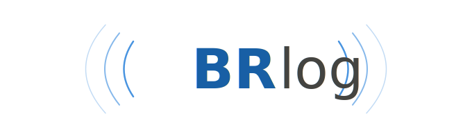

<p align="center">
  
</p>

# BRlog

Multiplatformní radioamatérský denník — nativní desktopová aplikace.

## Stack

- **Rust** + **Iced** (GPU-akcelerované UI přes `wgpu`)
- **SQLite** (přes `rusqlite`) pro lokální storage
- ADIF import/export
- Single binary, žádný Electron, žádný webview

Cíl: Windows, Linux, macOS.

## Build

```bash
cargo run            # debug
cargo build --release
```

První build stáhne a zkompiluje Iced + závislosti (~5-10 min).

## Stav

Early development — MVP scope:

- [ ] Operator config (callsign, jméno, QTH, lokátor)
- [ ] Ruční zápis QSO
- [ ] Tabulka QSO s filtrem/hledáním
- [ ] ADIF import / export
- [ ] SQLite storage

Mimo MVP: QRZ.com lookup, LoTW/eQSL upload, mapa, CAT control, DX cluster, DXCC statistiky.

## Licence

GPL-3.0-or-later — viz [LICENSE](LICENSE).
